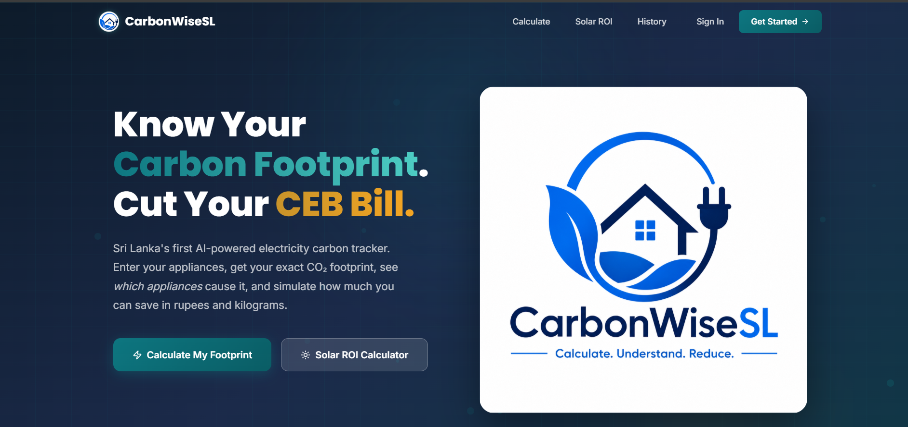
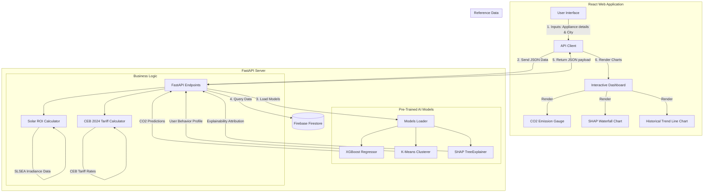

# CarbonWiseSL

<p align="center">
  
</p>

<p align="center">
  <b>AI-Powered Household Electricity Carbon Prediction, Explainability, and Reduction Web Application for Urban Sri Lankan Households</b>
</p>

<p align="center">
  
  
  
  
  
</p>

> [!NOTE]  
> **Academic Context:** Developed as part of the **CIS6035 Software Engineering Development Project** for the **BSc (Hons) Software Engineering** program.  
> **Author:** Kuruppu Arachchige Madhuka Virajith (St20311741)  
> **Methodology:** Agile Scrum — 8 Sprints (April 25 – August 10, 2025)

---

## 📖 Table of Contents

- [Overview](#-overview)
- [System Architecture](#-system-architecture)
- [Key Features](#-key-features)
- [Tech Stack](#-tech-stack)
- [AI & Machine Learning Models](#-ai--machine-learning-models)
- [Project Structure](#-project-structure)
- [Data Sources & Standards](#-data-sources--standards)
- [Local Development Setup](#-local-development-setup)
- [API Endpoints Reference](#-api-endpoints-reference)
- [Deployment Guide](#-deployment-guide)
- [License](#-license)

---

## 🌟 Overview

**CarbonWiseSL** is the first AI-powered electricity carbon footprint tracker engineered specifically for urban Sri Lankan households. Combining machine learning with local energy grid data, it enables households to forecast carbon emissions, isolate energy-hogging appliances using advanced explainable AI (SHAP), profile user consumption behavior (K-Means), and simulate green energy transformations.

---

## 🏗️ System Architecture

The application is structured into three main layers: a high-performance **React.js** frontend with rich data visualizations, a lightweight **FastAPI** backend containerized using Docker, and an offline **Machine Learning training pipeline** that exports serialized models to the production environment.



---

## ✨ Key Features

*   🔮 **Emission Forecasting (XGBoost Regression)**: Predicts daily and monthly electricity CO₂ output (in kg) based on appliance operational profiles.
*   🔍 **Explainable AI Appliance Breakdown (SHAP)**: Employs a SHAP TreeExplainer to compute exact per-appliance carbon attributions and visualizes them on a clear waterfall chart.
*   📊 **Behavioral Profiling (K-Means Clustering)**: Clusters household consumption behavior to place users into profiles, unlocking hyper-personalized reduction recommendations.
*   📈 **What-If Behavior Simulator**: Simulates the carbon-saving impact of changing appliance usage hours or replacing appliances with five-star energy-rated models *before* any real-world changes are made.
*   ☀️ **Solar ROI Calculator**: Forecasts solar panel installation costs, carbon offset capabilities, and financial payback periods using city-level solar irradiance data from the Sri Lanka Sustainable Energy Authority (SLSEA).
*   🕒 **Historical Tracker**: Stores past predictions in Firebase Firestore to monitor emission curves over time.

---

## 🛠️ Tech Stack

| Layer | Technologies Used |
| :--- | :--- |
| **Frontend Framework** | React.js · React Router |
| **Visualizations** | Recharts (Responsive charts) · Canvas-gauges |
| **Backend API** | FastAPI (Python) · Uvicorn (ASGI web server) |
| **AI / Machine Learning** | XGBoost · SHAP (Explainable AI) · Scikit-Learn (K-Means) |
| **Serialization** | Pickle (`.pkl`) |
| **Database** | Firebase Firestore (NoSQL database for emission history) |
| **Deployment & Containers** | Docker (Backend containerization) · Render.com (API) · Vercel (Frontend) |
| **Data References** | SLSEA 2024 (Grid and Solar) · CEB Tariff 2024 · UCI Dataset |

---

## 🧠 AI & Machine Learning Models

CarbonWiseSL splits model training from model production serving to maintain a lightweight, scalable web application architecture.

| Model | Type | Task / Purpose | Performance Targets |
| :--- | :--- | :--- | :--- |
| **XGBoost Regressor** | Supervised learning regression | Predicts daily household CO₂ footprint (kg) based on active appliances and hours of usage | $R^2 \ge 0.85$, $MAE \le 0.10$ |
| **SHAP TreeExplainer** | Explainable AI (XAI) | Calculates exact additive feature importance values per appliance for each prediction | Exact calculation (no approximation) |
| **K-Means Clustering** | Unsupervised learning | Clusters households into distinct behavior groups to generate tailored carbon reduction suggestions | Silhouette score $\ge 0.30$ |

---

## 📂 Project Structure

```text
carbonwise-sl/
├── assets/                     ← Graphic assets & UI mockups
│   └── dashboard_mockup.png
├── backend/                    ← FastAPI Python server
│   ├── main.py                 ← App entry point
│   ├── schemas.py              ← Pydantic schemas (input/output validation)
│   ├── models_loader.py        ← Loads serialized .pkl files at startup
│   ├── routers/
│   │   ├── predict.py          ← POST /api/predict (XGBoost prediction)
│   │   ├── explain.py          ← POST /api/explain (SHAP waterfall values)
│   │   ├── cluster.py          ← POST /api/cluster (K-Means profiling)
│   │   ├── simulate.py         ← POST /api/simulate (What-if scenario analysis)
│   │   ├── solar.py            ← POST /api/solar (Solar ROI calculator)
│   │   ├── history.py          ← GET/POST /api/history (Firebase history tracker)
│   │   └── health.py           ← GET /api/health (Health check & status)
│   ├── models/                 ← Directory for serialized models (gitignored)
│   ├── requirements.txt
│   ├── Dockerfile
│   └── .env.example
│
├── frontend/                   ← React.js web application
│   ├── src/
│   │   ├── pages/
│   │   │   ├── LandingPage.js  ← Premium landing page
│   │   │   ├── AppPage.js      ← Main carbon calculation panel
│   │   │   ├── ResultsPage.js  ← Dynamic carbon analytics dashboard
│   │   │   ├── SolarPage.js    ← Interactive Solar ROI estimator
│   │   │   └── HistoryPage.js  ← Visual carbon history logs
│   │   ├── components/
│   │   │   ├── Navbar.js       ← Navigation
│   │   │   ├── Footer.js       ← Footer details
│   │   │   ├── ApplianceForm.js← Structured input forms
│   │   │   ├── SummaryCards.js ← Core stats cards
│   │   │   ├── ShapChart.js    ← SHAP waterfall chart wrapper
│   │   │   ├── ClusterCard.js  ← User profile recommendations view
│   │   │   ├── WhatIfSimulator.js ← Interactive sliders for simulation
│   │   │   ├── EmissionGauge.js← Visual emissions speedometer gauge
│   │   │   ├── TrendChart.js   ← Historical line charts
│   │   │   ├── Loader.js       ← Customized loading spinner
│   │   │   └── EmptyState.js   ← Fallback empty layouts
│   │   ├── App.js              ← Main routing entrypoint
│   │   ├── api.js              ← Axios HTTP calls setup
│   │   └── index.css           ← Centralized CSS layout variables
│   ├── public/
│   │   ├── favicon.ico
│   │   ├── logo192.png
│   │   └── index.html
│   ├── package.json
│   └── .env.example
│
├── ml/                         ← ML pipeline (run locally or on Colab)
│   ├── scripts/
│   │   ├── data_loader.py      ← Raw data preprocessor
│   │   ├── feature_engineering.py ← Custom engineering routines
│   │   ├── train_xgboost.py    ← Regressor training script
│   │   ├── train_kmeans.py     ← Clusterer profiling script
│   │   ├── train_shap.py       ← SHAP explainer serialization script
│   │   └── evaluate.py         ← Model evaluation suite
│   ├── data/                   ← Dataset storage (gitignored)
│   ├── models/                 ← Output folder for trained .pkl models (gitignored)
│   └── requirements.txt
│
├── docker-compose.yml          ← Orchestration file for full stack
├── .gitignore
└── README.md
```

---

## 📈 Data Sources & Standards

To ensure localized accuracy, CarbonWiseSL integrates regional Sri Lankan energy statistics and tariffs:

*   ⚡ **Grid Emission Factor (SLSEA 2024)**: Programmed at **0.52 kg CO₂/kWh**, reflecting Sri Lanka’s national grid energy mix (thermal, hydro, and non-conventional renewables).
*   💵 **Domestic Tariff Structure (CEB 2024)**: Implements the official Ceylon Electricity Board (CEB) progressive 5-tier pricing model for domestic connections.
*   🌞 **Solar Irradiance Tables (SLSEA)**: Pulls actual average solar irradiation values (kWh/m²/day) across key regional urban cities (Colombo, Kandy, Galle, etc.) to compute realistic solar sizing.
*   💾 **UCI Household Electric Power Consumption**: Used as a baseline for pre-training models before applying regional Sri Lankan transfer adjustments.
*   📋 **Appliance Consumption Survey**: Synthesized using primary research metrics for standard domestic appliances in Sri Lankan homes.

---

## 🚀 Local Development Setup

### Prerequisites
*   [Python 3.11+](https://www.python.org/downloads/)
*   [Node.js 20 LTS](https://nodejs.org/)
*   [Docker Desktop](https://www.docker.com/products/docker-desktop/) (Optional - for containerized setup)

### 1. Clone the Project
```bash
git clone https://github.com/madhukavirajith/CarbonWiseSL.git
cd CarbonWiseSL
```

### 2. Train and Export ML Models
Before launching the backend, you must train the models locally to generate the necessary `.pkl` binaries.
```bash
cd ml
pip install -r requirements.txt

# Place your dataset under ml/data/
# Train and generate models:
cd scripts
python train_xgboost.py
python train_kmeans.py
python train_shap.py

# Verify model performance
python evaluate.py

# Move the generated .pkl files to the backend directory
copy ..\models\*.pkl ..\..\backend\models\      # Windows
# cp ../models/*.pkl ../../backend/models/       # macOS/Linux
```

### 3. Spin up the FastAPI Backend
```bash
cd ../../backend
python -m venv venv

# Activate Virtual Environment
venv\Scripts\activate                            # Windows (PowerShell/CMD)
# source venv/bin/activate                      # macOS/Linux

pip install -r requirements.txt
copy .env.example .env                           # Windows
# cp .env.example .env                           # macOS/Linux

# Start Server
uvicorn main:app --reload --port 8000
```
> [!TIP]  
> The backend server will run at `http://localhost:8000`. You can inspect and test the API at `http://localhost:8000/docs`.

### 4. Spin up the React Frontend
```bash
cd ../frontend
copy .env.example .env                           # Windows
# cp .env.example .env                           # macOS/Linux

npm install
npm start
```
> [!TIP]  
> The frontend application will launch automatically at `http://localhost:3000`.

### 5. Alternative: Run with Docker Compose
To build and run the entire ecosystem (React + FastAPI) in synchronized Docker containers, use:
```bash
docker compose up --build
```
*   **Web Dashboard**: `http://localhost:3000`
*   **API Docs**: `http://localhost:8000/docs`

---

## 🔌 API Endpoints Reference

All requests and responses use JSON formatting. The backend API schema definitions are enforced via Pydantic.

| Method | Endpoint | Description |
| :--- | :--- | :--- |
| **GET** | `/api/health` | Service health check. Reports availability of backend routes and checks model load status. |
| **POST** | `/api/predict` | Computes daily and monthly CO₂ electricity emission estimates using the XGBoost model. |
| **POST** | `/api/explain` | Computes SHAP force/waterfall values to detail appliance-specific emission contributions. |
| **POST** | `/api/cluster` | Predicts K-Means cluster and outputs the user profile label with corresponding reduction advice. |
| **POST** | `/api/simulate` | Evaluates what-if usage scenarios to project potential carbon and cost savings. |
| **POST** | `/api/solar` | Computes Solar ROI, installation paybacks, and lifetime carbon offsets for a selected city. |
| **POST** | `/api/history/save` | Records user emissions records to Firebase Firestore. |
| **GET** | `/api/history/{user_id}` | Retrieves historical carbon calculation charts for the specified user. |

---

## 🌐 Deployment Guide

This project is optimized for continuous delivery (CD) deployment using GitHub webhooks.

### Backend Hosting → Render (Docker Service)
1. Register/Login on [Render.com](https://render.com/).
2. Create a **New Web Service** and authorize access to your `CarbonWiseSL` repository.
3. Configure settings:
    *   **Root Directory**: `backend`
    *   **Runtime**: `Docker`
    *   **Instance Type**: `Free` or higher
4. Define Environment Variables:
    *   `ALLOWED_ORIGINS` = `https://your-frontend-vercel-domain.vercel.app`
5. Click **Deploy Web Service**.

### Frontend Hosting → Vercel
1. Log in to [Vercel](https://vercel.com/).
2. Click **Add New** → **Project**, and import the repository.
3. Configure settings:
    *   **Root Directory**: `frontend`
    *   **Framework Preset**: `Create React App`
4. Define Environment Variables:
    *   `REACT_APP_API_URL` = `https://your-backend-render-url.onrender.com`
5. Click **Deploy**.

---

## 📄 License

This project is licensed under the MIT License - see the [LICENSE](LICENSE) file for details. Open for academic, research, and conservation use cases.